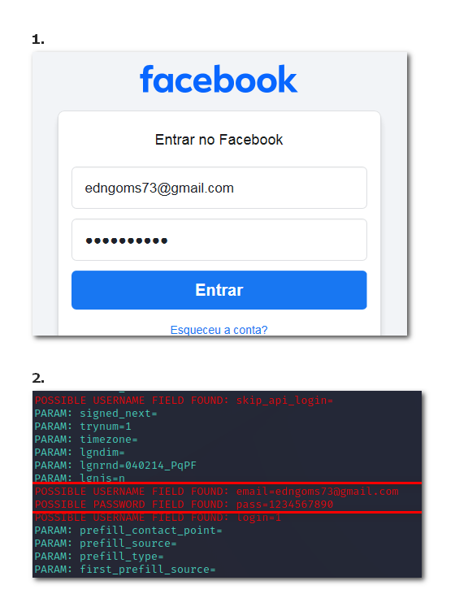

# Phishing para captura de senhas do Facebook

### Ferramentas usadas

- Kali Linux
- setoolkit

### Configurando o Phishing no terminal do Kali Linux

- Acesso root: ``` sudo su ```
- Iniciando o setoolkit: ``` setoolkit ```
- Tipo de ataque: ``` seleconar opção - Social-Engineering Attacks ```
- Vetor de ataque: ``` seleconar opção -  Web Site Attack Vectors ```
- Método de ataque: ``` seleconar opção - Credential Harvester Attack Method ```
- Método de ataque: ``` seleconar opção -  Site Cloner ```
- Obtendo o endereço da máquina: ``` ifconfig ```
- URL para clone: http://www.facebook.com

### Resutados




